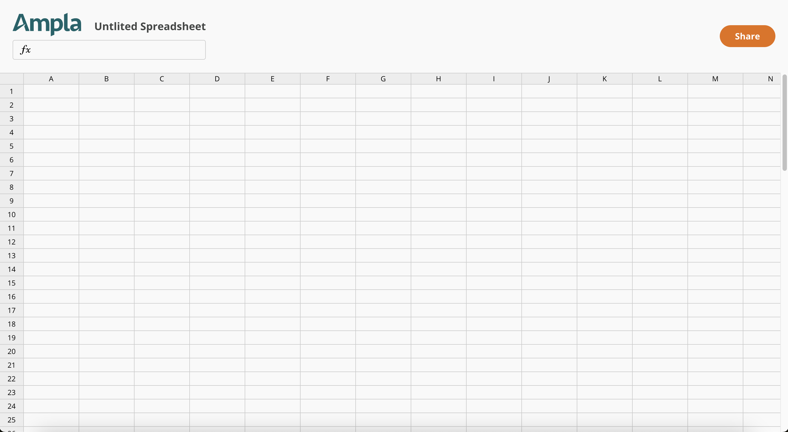

# Ampla Frontend Code Challenge

This is a project to build a mini clone of a spreadsheet, with the main goal of referencing cells and detecting circular references.

## Prerequisites

Before you begin, ensure you have the following tools installed:

- [Docker](https://www.docker.com/get-started)
- [Node.js](https://nodejs.org/) (for running the project locally)

## Installation

1. Clone this repository to your local machine:

   ```bash
   git clone https://github.com/LucasMallmann/react-sheet
   ```

2. Change your working directory to the project folder:

   ```bash
   cd react-sheet
   ```

3. Install project dependencies. You can choose to run it locally or inside a Docker container.

### Running Locally

- If you want to run the project locally, make sure you have Node.js installed on your machine. You need to have a node version >= 18 (LTS).

  ```bash
  npm install
  ```

### Running Inside Docker

- If you prefer running the project inside a Docker container, you don't need to install any local dependencies (except for Docker itself). There is a docker-compose.yml at the root of the project, all you need to do is:

  Build the Docker image:

  ```bash
  docker-compose up
  ```

## Running the Project

After you've completed the installation, you can run the project either locally or inside a Docker container.

### Running Locally

1. Start the development server:

   ```bash
   npm run dev
   ```

2. Open your web browser and go to [http://localhost:5173](http://localhost:5173) to access the project.
3. You can also build the production version instead of the development server. All you need to do is:
   ```bash
   npm run server
   ```
   This will start a server at [http://localhost:5173](http://localhost:5173).

### Running Inside Docker

1. Start the Docker container using the provided `docker-compose.yml` file:

   ```bash
   docker-compose up
   ```

2. Open your web browser and go to [http://localhost:3003](http://localhost:3003) to access the project.

## Additional Commands

- `npm run build`: Build the project for production.
- `npm run lint`: Run ESLint to check your code for errors.
- `npm run preview`: Preview the production build locally.
- `npm run test`: Run tests using Vitest.

## Project Structure

- `src/`: Contains your project source code.

  - `__tests__`: Unit tests.
  - `components`: Reusable React Components.
  - `context`: Global Spreadsheet context to be used across all components.
  - `hooks`: Utilitary reusable react hooks.
  - `style`: Global styles to reset some defaults, and add global variables.
  - `utils`: Utilitary functions to parse values, evaluate formulas, update cell values recursively.

- `public/`: Contains static assets.
- `package.json`: Defines project dependencies and scripts.
- `Dockerfile`: Defines the Docker image for this project.
- `docker-compose.yml`: Sets up a Docker container for development.

## Demo



## Features

- [x] When the user starts typing when the cell is visually highlighted (such as after the first click), then any keyboard input should show up in the cell.
- [x] If the cell's value starts with "=", then we know that what follows the "=" needs to be a reference to another cell. So if the user enters "=A1" in a cell, that cell will display the same value as A1. You do not need to implement any other types of formulas other than a simple straight reference.
- [x] If a referenced cell changes, then the displayed content of dependent cells need to immediately change - this includes also dependent cells of dependent cells. For example if A1 is the number 42, and B2 references A1, and C3 references B2, then C3 should show 42. If A1 is changed to 36, both B2 and C3 needs to also change to 36.
- [x] Your spreadsheet should be able to handle circular references gracefully without throwing a stack overflow exception or causing a crash. Circular references are situations where, for example (but not limited to):
  - A1 references A2
  - A2 references A3
  - A3 references A1
    The circular reference can be a chain of references of any length. Your spreadsheet should output some type of error to notify the user of the existence of the circular reference and allow the user to remedy the issue.
- [x] Somewhere on the page, the user also needs to be able to generate a unique link back to the same spreadsheet. This link can be copied and pasted into a different browser window which will open the same spreadsheet. You do not need to worry about read/write permissions. Going to the root url will create a new spreadsheet.

## License

This project is licensed under the MIT License. See the [LICENSE](LICENSE) file for details.

Feel free to modify this README.md to match your project's specific requirements and include any additional information that is relevant to your team or users.
